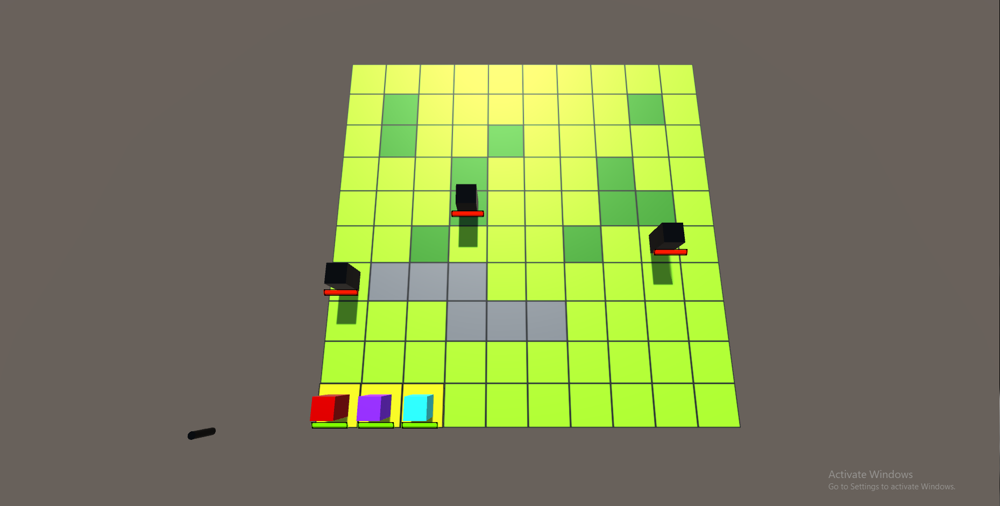
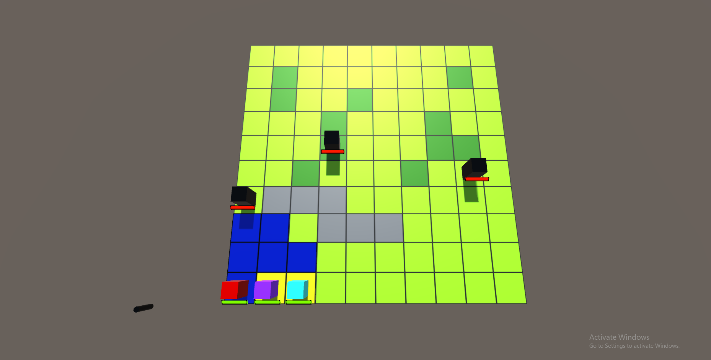
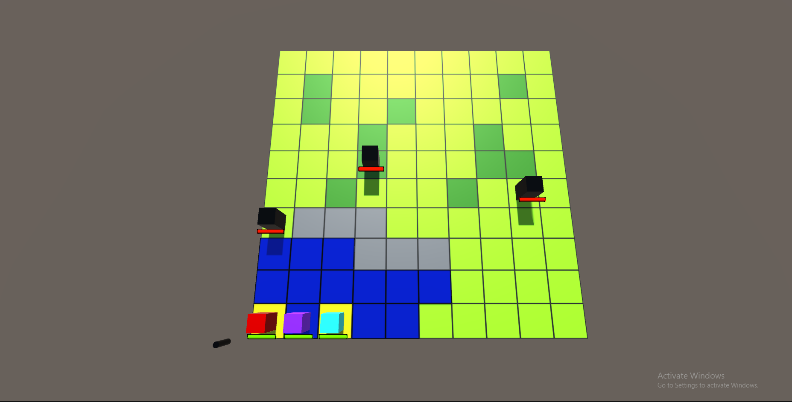
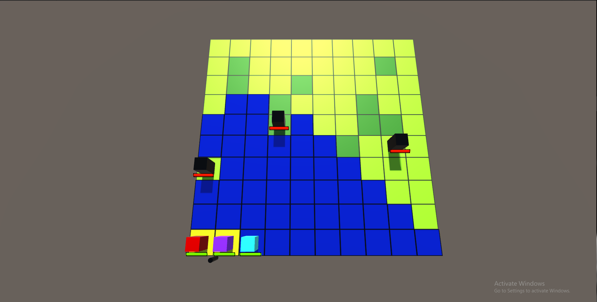
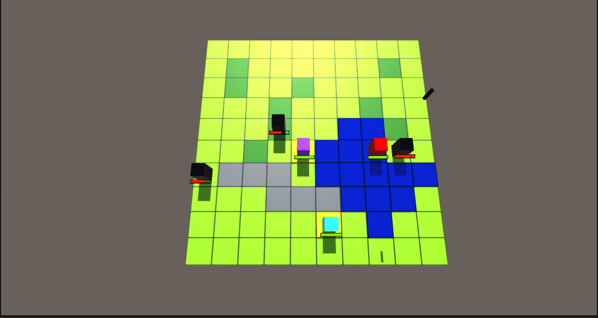
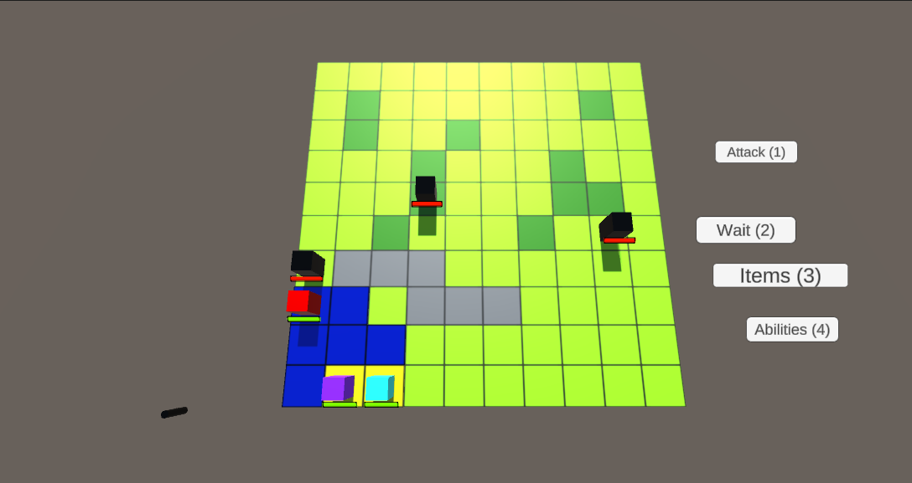
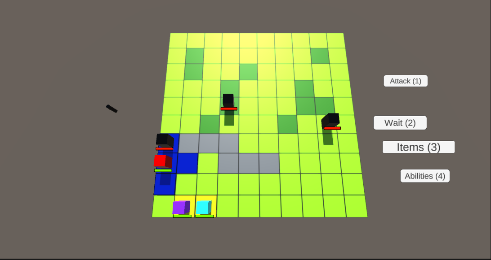
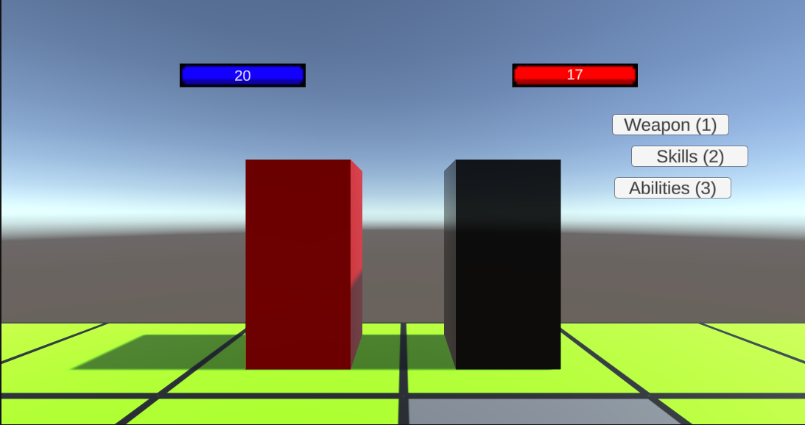

## FE-Engine
This is a turn-based strategy game framework based on Fire Emblem. Made with Unity and C#.
# Player Turn
- On your turn, you take action by moving your units, either to attack or to move to a safer position.
- In this example, there are three units: Red (Swordfighter), Purple (Archer) and Turquoise (Pegasus Knight).

- If we hover the cursor (controlled by arrow keys) over Red and hit the A key (select), tiles on the map light up blue.

- These tiles are where our red unit can traverse.
- Similarily, if we select Purple,

- Or turquoise,

- Blue tiles light up on the map. As shown, each unit has differing moblity based on their class.
- Furthermore, the terrain on the map affects each unit as well. Open grass (light green tiles) cost only 1 movement points, but dark green tiles (forests) cost 2, as shown below (Red has 3 movement points).

- Wall/Barrier tiles (grey) are impassable by land units, and in essence cost 99 movement points (no unit has that many).
- However, flying units, such as Turquoise (Pegasus Knight) are unaffected completely by Wall/Barrier tiles. Flying units also boast extreme mobility, but are balanced out by a severe weakness to Archer units.
- The tiles that light up are computed by a variant of the A* pathfinding algorithm, which takes in unit class (to calculate movement points and land/air type) and values representing the different tiles on the map.
- The Red unit (Swordfighter) has the least amount of movement points, but makes up for it with defensive and offensive capabilities.
- The Purple unit (Archer) has much more moblity, but lacks defensive capability.
# Attacking Enemy Units
- Let's move red up close to an enemy unit (Black), and hit A (to confirm position/view available actions at a tile for a specific unit).

- Player UI pops up, and we can see we now have four actions: Attack, Wait, Items, and Abilities.
- Wait means that we want the unit to take no action. It is often selected when mocing units to safety. Selecting Items allows you to use items that heal your units, or place a temporary buff on them.
- Lastly, Abilities are actions unique to each unit. Some are attacks that deal large damage or splash damage, and other ablities include high level buffs.
- Let's select attack for now. New tiles light up blue. This is our attack range for Red, which is only 1 tile as he is a swordsman. (If no enemies were in our range of attack, which differs from unit to unit, the Attack button would not be an option).

- Now, let've move our cursor over the enemy unit and hit A to select that unit to attack. We are now taken to the attack view, where can select a weapon attack, a skill attack, or an offensive ability (provided the unit has one). Furthermore, if we change our mind at any point before we attack, we can hit S to return to the previous action, all the way back to selecting a unit to take action with.

- Let's select the weapon attack.
[Attacking Red Weapon View](Assets/Images/Readme/ss9.PNG)
- Now we must select a weapon to attack with. Let's hit 1 for Damascus. Each unit has different weapons, and different classes have access to only certain weapons. For example, Archers cannot wield weapons of the Sword class.
- Damage is done to the enemy, and damage is taken by Red. These values are calculated based on unit stats, weapon stats, and attack stats. Some weapons deal major damage to specific units, e.g. bow type weapons to Flying units as previously mentioned.
[Attacking Red Damage Done](Assets/Images/Readme/ss10.PNG)
- Which unit attacks first is dependent on speed. Some Skills allow a unit to move first regardless of speed.
# Attacking More Enemy Units
- After we have made our attack, the game returns us to the map view. As you can see, health bars have now been modified.
[Map view after attack](Assets/Images/Readme/ss11.PNG)
- Let's use Purple to attack another unit.
- As you can see, Purple has a much greater attack range than Red.
[Purple attack](Assets/Images/Readme/ss16.PNG)
[Purple attack](Assets/Images/Readme/ss12.PNG)
- Lastly, let's mobilize Turquoise, fly over the Wall tiles, and attack an enemy unit.
[Turqouise attack](Assets/Images/Readme/ss13.PNG)
# Enemy Turn
- After we have moved all our units, it is now the enemy's turn (CPU) to move. Click F to advace to Enemy Turn.
- Enemy units will automatically move and attack our units based on an algorithm that finds their optimal move, taking in account of their health, location, location of other enemy units, their class advantages/disadvantages.
- The enemy fighing Red re-engages, and we can once again select our method of attack.
[Enemy Re-engages](Assets/Images/Readme/ss14.PNG)
- The enemy fighting Turquoise also re-engages because it is certain he will die the next turn, even if he tries to run do to Turquoise's mobility, so his best move is to deal as much damage as possible before perishing. A sad fate.
[Enemy Re-engages Turq](Assets/Images/Readme/ss15.PNG)
- The last enemy takes no move, as he is set to "Passive" status, meaning to route this enemy we must engage first.
- After the enemy has taken their moves, the player can now move again.
- The cycle repeats until all units on one side have been routed.
# Parameters
- Inside the Unity inspector, you can toggle unit classes, stats, weapons, and mobility and see how that affects gameplay.

